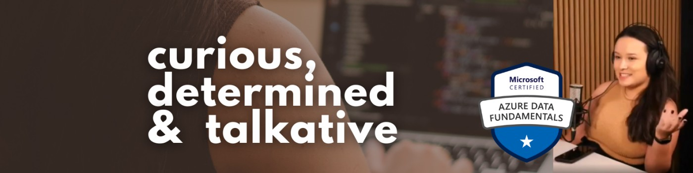

## Hello I'm Viviane, but you can call me Vivi!  

### About me 
A dedicated professional committed to continuous learning and driven by curiosity, I am completing my degree in Analysis and Systems Development this semester.
Among my personal goals for this year are:  obtaining the Databricks Data Engineer Associate certification and reaching the next level of fluency in English: C1, to expand my experience as a data engineer in international projects. 

### Certifications 
[</a>]([https://web.dio.me/track/decola-tech-avanade-net-developer?tab=path](https://www.databricks.com/en-website-assets/static/59d617a0d0fde89500f1fb046d4470fb/13212.png))
[</a>]([https://web.dio.me/track/decola-tech-avanade-net-developer?tab=path](https://www.databricks.com/en-website-assets/static/59d617a0d0fde89500f1fb046d4470fb/13212.png))

### Github stats

  <a href="https://github.com/vivianecorrea">
  
  

 

### Don't hesitase to Connect with me

   

